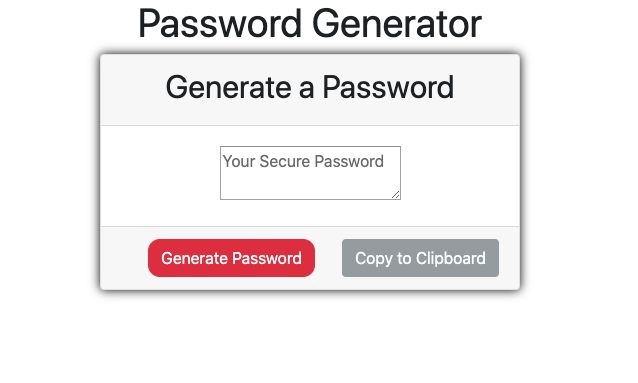
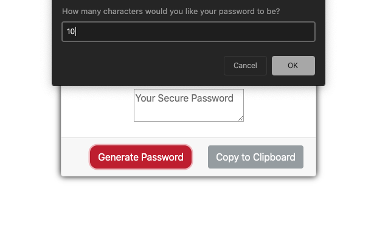
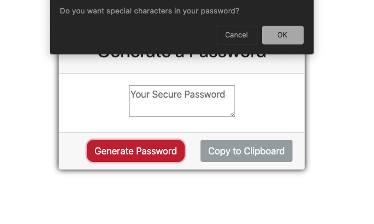
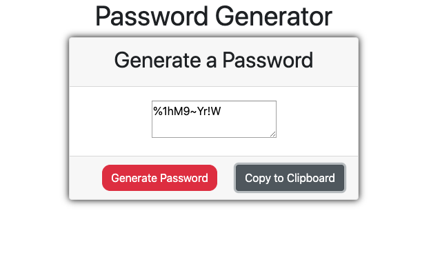

# pwdmgr

##Description
---
You can use this tool to help you create a secure password that you can use on a website or application of your choice. 
You just click the generate button then it will start by asking you how many characters in length you would like your password to be. From there you follow the prompts to decide if you need numbers, special characters, upper and lowercase letters. 
Once that is completed you can click the 'copy to clipboard' button to easily paste your newly created password into the needed field.

#Images

